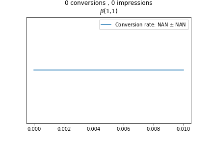
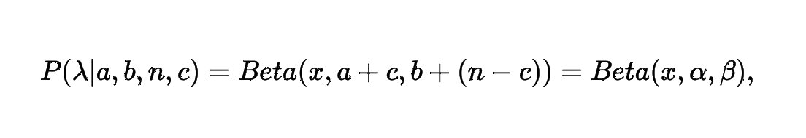
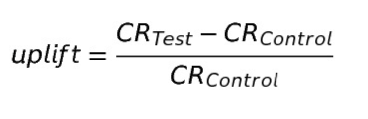
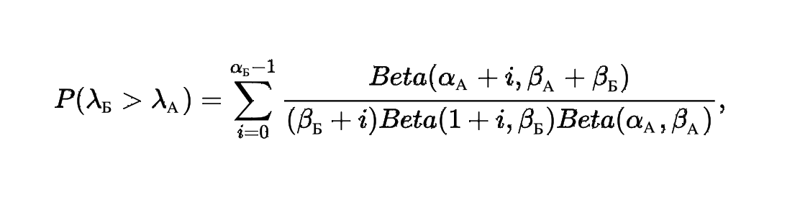

# quick start
Use my packet [byas_ab.py](https://github.com/kodinkod/byes_a_b_tests/blob/main/byas_ab.py) like in [quick_start notebooks](https://github.com/kodinkod/byes_a_b_tests/blob/main/quick_start.ipynb)

# bayesian-a-b-testing; Simple pipline:  [notebooks](https://github.com/kodinkod/byes_a_b_tests/blob/main/bayesian-a-b-testing-1/pipline_1.ipynb)
p.s this is a project for learning. Supplemented

<b>Prior distribution</b> - (Befor experiments)  the distribution is taken as an a priori distribution is - Beta(1,1); 

<b>Posterior distribution</b> - need to calculate (step 1.)

## 1. Generate test data;
 
<b>Control group</b> - Data about the system on which nothing has changed (the website page with the 'buy' button). number of observations, number of target events;
 
<b>Test group</b>  - Data about the same system on which we are testing new hypotheses (changed the color of the "buy" button).  number of observations, number of target events;

## 2. PDF's fot r test and control group (Calculate posterior probability)

  
    λ - conversion, n - number of observations, c - number of target events, (a,b) - parameters of a priori probability.

 

## 3. Calculating the lift

## 4. Calculating probabiliti -  [code](https://github.com/kodinkod/byes_a_b_tests/blob/main/bayesian-a-b-testing-1/calc_prob.py)

### References
 - [ Bayesian A/B Testing with Python: the easy guide ](https://towardsdatascience.com/bayesian-a-b-testing-with-python-the-easy-guide-d638f89e0b8a)
 - [Formulas for Bayesian A/B Testing](https://www.evanmiller.org/bayesian-ab-testing.html)
 - [Bayesian A/B Testing: a step-by-step guide](http://www.claudiobellei.com/2017/11/02/bayesian-AB-testing/#mjx-eqn-eqposterior_analytic)
 

